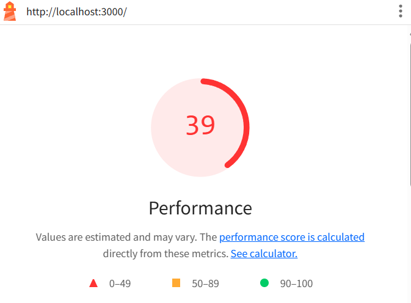
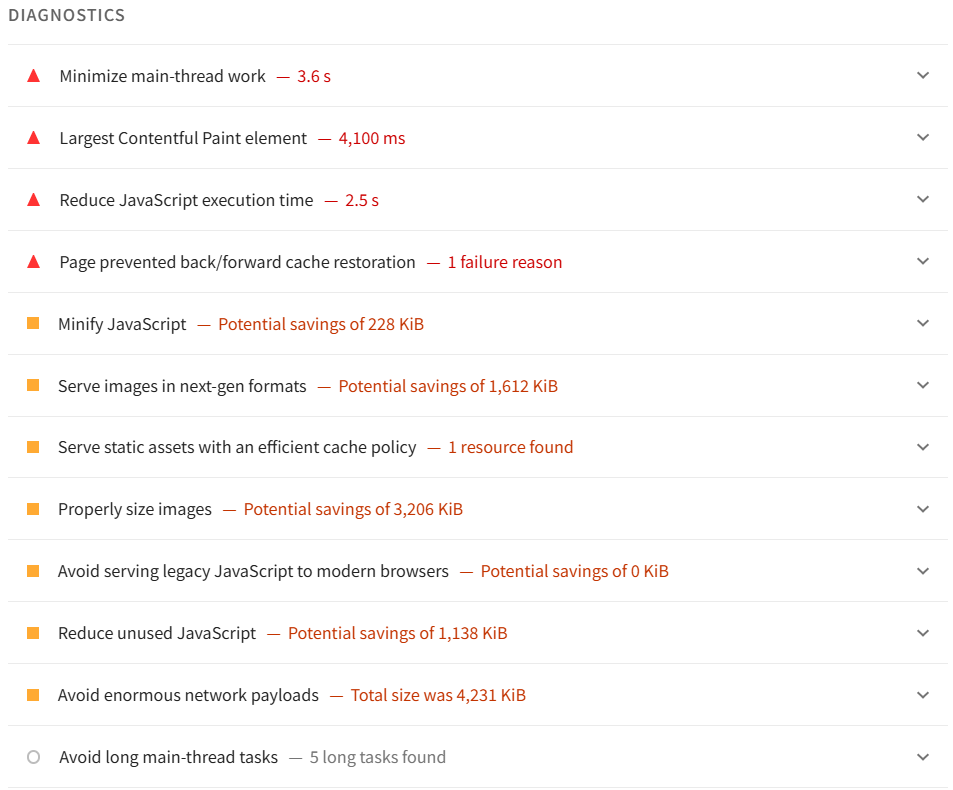
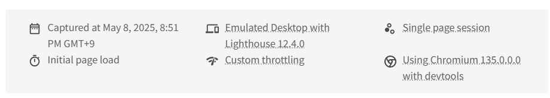
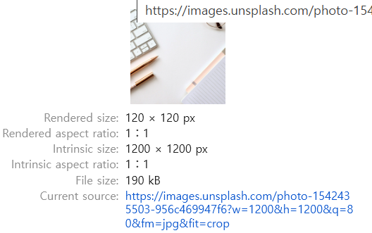

> 웹 성능을 최적화하면 서비스 사용자에게더 나은 사용자 경험(UX)를 제공할 수 있으며, 이로 인해 가입률과 전환율을 높이고 이탈률은 낮춰 더 많은 수익을 창출할 수 있습니다.

## 웹 성능은 로딩 성능과 렌더링 성능으로 나눌 수 있습니다.

### 로딩 성능

서버에 있는 웹 페이지와 필요한 기타 리소스를 다운로드할 때 성능입니다. 고화질 이미지, HTML, CSS, JS 파일의 크기가 너무 크면 로딩이 느려서 웹 페이지가 느리게 표시됩니다.

### 렌더링 성능

다운로드한 리소스를 가지고 화면을 그릴 떄의 성능입니다. 자바스크립트 코드를 얼마나 효율적으로 작성했느냐에 따라 화면이 그려지는 속도와 사용자 인터랙션의 자연스러운 정도가 달라집니다. 적절한 최적화 기법을 적용하려면 사용하는 프레임워크의 라이프사이클 등 웹 개발의 기본 지식을 알아야 합니다.

---

# 1장 블로그 서비스 최적화

### 최적화 기법

| 항목                 | 설명                                                                                                                      |
| -------------------- | ------------------------------------------------------------------------------------------------------------------------- |
| 이미지 사이즈 최적화 | 적절한 이미지 사이즈를 선정해 성능을 높일 수 있습니다.                                                                    |
| 코드 분할            | 첫 페이지 진입 시 당장 사용하지 않는 코드는 코드 분할을 통해 떼어내고, 해당 코드를 필요한 시점에 따로 로드할 수 있습니다. |
| 텍스트 압축          | HTML, CSS, JS 등은 다운로드 전에 서버에서 미리 압축해 원래 사이즈보다 더 작은 사이즈로 다운로드 할 수 있습니다.           |
| 병목 코드 최적화     | 서비스를 느리게 만드는 병목 코드를 찾아내 최적화 할 수 있습니다.                                                          |

### 분석 툴

| 도구/패널               | 설명                                                                                                                                                   |
| ----------------------- | ------------------------------------------------------------------------------------------------------------------------------------------------------ |
| 크롬 개발자 도구 (F12)  | 웹 페이지 디버깅 및 성능 분석을 위한 기본 도구입니다.                                                                                                  |
| Network 패널            | 현재 웹 페이지에서 발생하는 모든 네트워크 트래픽을 상세하게 보여주며, 리소스의 크기와 로드 시점을 확인할 수 있습니다.                                  |
| Performance 패널        | 웹 페이지가 로드될 때 실행되는 작업들을 추적할 수 있고, 자바스크립트 실행 타이밍을 차트 형태로 확인할 수 있습니다. 느린 코드를 식별하는 데 유용합니다. |
| Lighthouse 패널         | 웹사이트의 성능 점수를 측정하고, 접근성·SEO·성능 등에 대한 개선 가이드를 제공합니다.                                                                   |
| webpack-bundle-analyzer | 별도 설치가 필요한 도구로, 번들 파일 내 어떤 코드나 라이브러리가 포함되어 있는지 시각적으로 분석할 수 있으며, 불필요한 코드 식별에 유용합니다.         |

 

## Lighthouse 툴을 이용한 페이지 검사

### Mode

- Navigation: 기본 값, 초기 페이지 로딩 시 발생하는 성능 문제를 분석
- Timespan: 사용자가 정의한 시간 동안 발생한 성능 문제를 분석
- Snapshot: 현재 상태의 성능 문제를 분석

### Categories

- Performance: 웹 페이지의 로딩 과정에서 발생하는 성능 문제를 분석
- Accessibility: 서비스의 사용자 접근성 문제를 분석
- Best practices: 웹 사이트의 보안 측면과 웹 개발의 최신 표준에 중점을 두고 분석
- SEO: 검색 엔진에서 얼마나 잘 크롤링되고 검색 결과에 표시되는지 분석
- Progressive Web App: 서비스 워커와 오프라인 동작 등, PWA와 관련된 문제를 분석

> 웹 바이탈: 여섯가지 지표에 가중치를 적용해 평균 낸 점수

[1] First Contentful Paint (FCP)
페이지가 로드될 때 브라우저가 DOM 콘텐츠의 첫 번째 부분을 렌더링하는 데 걸리는 시간

[2] Speed Index (SI)
페이지 로드중에 콘텐츠가 시각적으로 표시되는 속도를 나타내는 지표. 순차적으로 렌더링된 경우와, 모두 로드되고 렌더링 된 경우의 속도가 같다면, 순차적으로 렌더링된 경우가 더 높은 점수를 받는다.

[3] Largest Contentful Paint (LCP)
페이지가 로드될 떄 화면 내에 있는 가장 큰 이미지나 텍스트 요소가 렌덜이되기까지 걸리는 시간

[4] Time to Interactive (TTI)
사용자가 페이지와 상호 작용이 가능한 시점까지 걸리는 시간을 측정한 지표. TTI가 다 걸리기 전까지는 화면이 모두 렌더링되더라도 클릭 같은 입력이 동작하지 않는다.

[5] Total Blocking Time (TBT)
페이지가 클릭, 키보드 입력 등의 사용자 입력에 응답하지 않도록 차단된 시간을 총합한 점수

[6] Cumulative Layout Shift (CLS)
페이지 로드 과정에서 발생하는 예기치 못한 레이아웃 이동을 측정한 지표. 화면상에서 요소의 위치나 크기가 순간적으로 변하는 것

- 아래에서 문제점과 해결방안, 해결함으로써 얻을 수 있는 이점을 확인할 수 있다.
  

- 검사환경 또한 확인할 수 있다.
  

검사 전 Device 설정에 따라 네트워크 속도를 제한하여 고정된 네트워크 환경에서 성능을 측정합니다. (Network throttling)

### 이미지 사이즈 최적화

[1] Properly size images
이미지를 적절한 사이즈로 사용하도록 제안합니다.

실제 이미지는 1200 X 1200px지만, 실제 그려지는 이미지의 사이즈는 120 x 120px로 사용하고 있습니다. 이미지를 최적화하기 위해서는 어디서 오는지 확인해야 합니다.

- API를 통해 받아오는 경우: Cloudinary, Imgix 같은 이미지 CDN을 사용한다.

> 이미지 CDN (Content Delivery Network): 물리적 거리의 한계를 극복하기 위해 소비자(사용자)와 가까운 곳에 콘텐츠 서버를 두는 기술, 기본적인 CDN 기능을 포함해 사용자에게 보내기 전에 특정 형태로 가공해 전달할 수 있다.

일반적인 이미지 CDN에서 제공하는 주소: `http://cdn.image.com?src=[img src]&width=240&height=240`

- 이미지 서버의 주소에 쿼리 스트링으로 가져올 이미지의 주소 또는 이름을 입력하고, 변경하고자 하는 형태(width, height)를 명시합니다.
