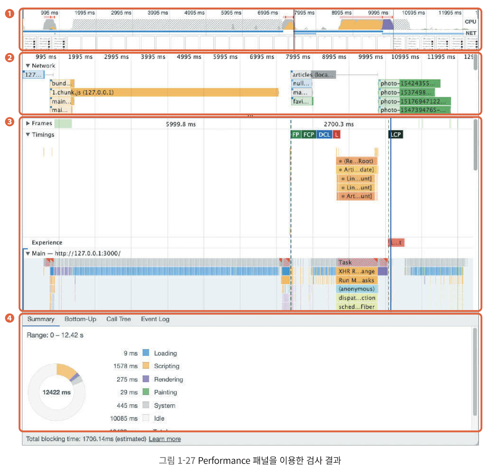
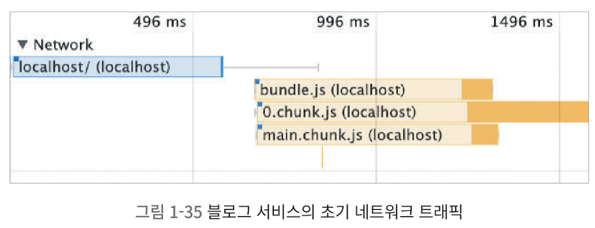
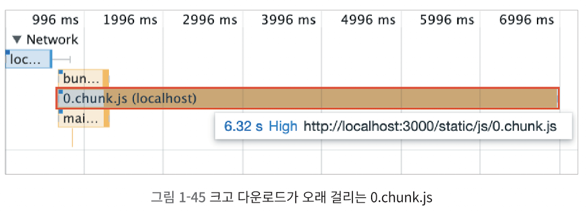
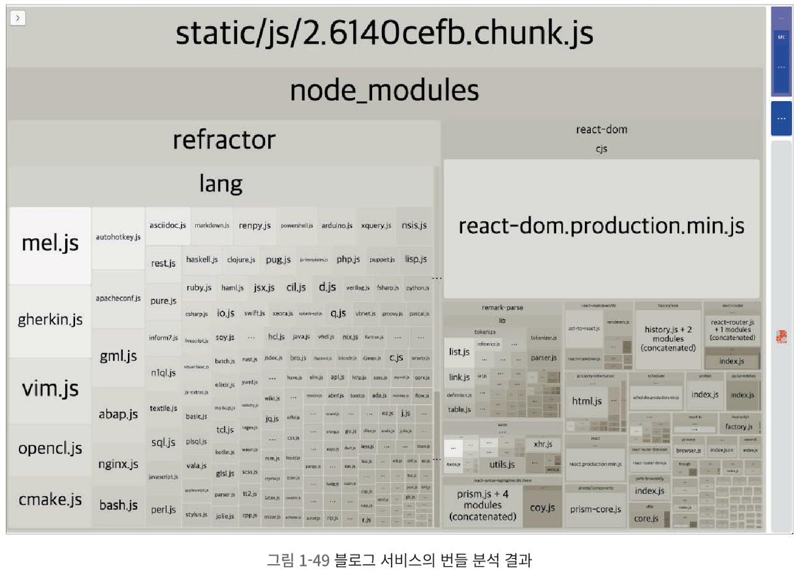
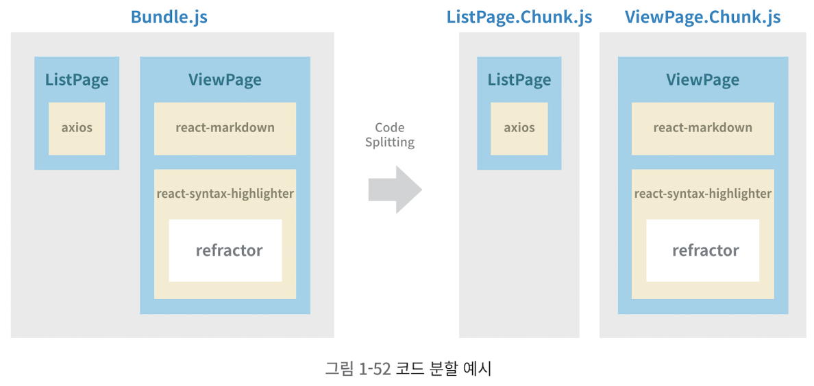
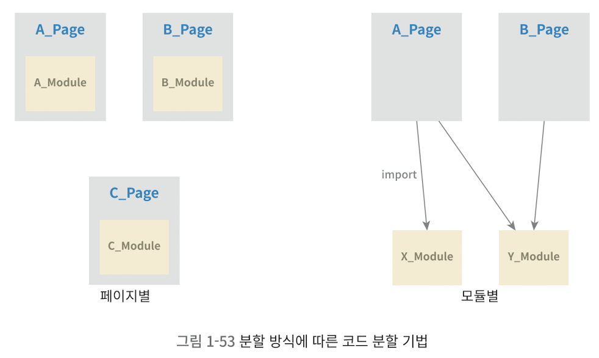

## 2. 병목 코드 최적화

### Performance 패널 살펴보기

- Diagnostic > Reduce Javascript execution time에서 특정 js 파일의 실행 시간을 확인할 수 있음
- 메인 스레드의 작업을 구체적으로 확인하고, 느린 작업이 무엇인지 확인하기 위해서는 Performance 패널을 확인하면 됨

### Performance 패널 활용 예시

- 개발자 도구의 Performance 패널로 이동해 테스트 환경을 적절히 세팅하고 Performance 측정을 완료하면 아래와 같은 화면이 나옴



1. CPU 차트, Network 차트, 스크린샷

   - 색깔에 따라 기능 구분
1. Network Timeline

   - 네트워크 요청을 시간 순서에 따라 보여줌
   - 네트워크 요청 우선순위, 연결시간, 메인 스레드의 작업시간 등 보여줌
1. Frames, Timings, Main

   - 화면의 변화가 있을 때마다 스크린샷 찍어줌 
   - React에서 각 컴포넌트의 렌더링 시간도 보여줌
1. 하단 탭

   - 전체/선택된 영역에 대한 상세 내용 확인 가능

### 페이지 로드 과정 살펴보기

- 페이지 로드

     
    - localhost: HTML 파일 요청(파란색)
    - bundle.js, 0.chunk.js ...: JS파일 요청(주황색)
        - 특이사항: 0.chunk.js 파일의 로드시간이 매우 길다
    - React 코드 실행: 빨간색
    - articles 데이터 다운로드 후 메인 스레드에서 컴포넌트 렌더링을 위해 JS 실행
- ArticleList <- 모든 데이터가 준비된 상태에서 단순 '렌더링'만으로 실행시간 1.4초?
    - 확인 방법: 그냥 메인 스레드 구간을 따라 내려가면 확인 가능 => 'removeSpecialCharacter' 작업이 시간 오래걸림 확인 가능!

    이제 이 코드를 성능 최적화 해보자!

### 병목 코드 개선

```js
/*
파라미터로 넘어온 문자열에서 일부 특수문자를 제거하는 함수
(Markdown으로 된 문자열의 특수문자를 제거하기 위함)
*/
function removeSpecialCharacter(str) {
  const removeCharacters = ['#', '_', '*', '~', '&', ';', '!', '[', ']', '`', '>', '\n', '=', '-']
  let _str = str
  let i = 0,
    j = 0
  for (i = 0; i < removeCharacters.length; i++) {
    j = 0
    while (j < _str.length) {
      if (_str[j] === removeCharacters[i]) {
        _str = _str.substring(0, j).concat(_str.substring(j + 1))
        continue
      }
      j++
    }
  }
  return _str
}
```

- 병목 원인
    - 2중 반복문과 substring, concat함수 사용 => 시간복잡도 증대
    - 위 작업은 JS의 replace로 대체 가능!
- 해결 방법

  1. 특수 문자 효율적으로 제거하기

      문자열 제거에 substring과 concat 대신 replace 사용하기!
  1. 작업량 줄이기

      서비스에 실질적으로 사용되는 부분만 탐색하고 변경해보자!

    => Lighthouse 점수가 많이 오른다!(특히 TBI와 TBT)

---

## 코드 분할 & 지연 로딩

### 번들 파일 분석

- webpack을 통한 번들링 파일 분석과 최적화
- 우선, 앞서 등장했었던 0.chunk.js 파일에 대해 알아보자!

    

    이렇게 화면을 그리는데 필요한 소스의 다운로드가 늦어지면 화면도 늦게 뜸
- 0.chunk.js 파일 분석해보기
    - Create React App에서도 간편하게 번들 사이즈를 분석할 수 있는 **cra-bundle-analyzer** 사용해보자!

    $ npm install --save--dev cra-bundle-analyzer

    $ npx cra-bundle-analyzer

- 실행하면 서비스의 번들 파일과 모든 패키지를 실제 크기에 따라 비율로 보여줌

    
- 크기가 가장 큰 2.chunk.js의 하위 요소에 node_modules가 있는 것으로 보아, 이 번들 파일이 담고 있는 코드가 npm을 통해 설치한 외부 라이브러이임을 알 수 있음
    - 2.chunk.js의 내부
        - refactor

            이 패키지의 출처를 알아보자

            package-lock.json 혹은 yarn.lock 찾아보기

        => react-syntax-hilighter라는 마크다운 스타일링 패키지는, 블로그 글 상세 페이지에만 필요 => 이 번들 파일을 **페이지별로 필요한 내용만 분리**하자!

- react-dom

### 코드 분할(Code Splitting)

- 코드를 분할해 하나의 번들 파일을 여러 개의 파일로 쪼개는 방법
- 지연 로딩: 분할된 코드가 사용자가 서비스를 이용하는 중 **해당 코드가 필요해지는 시점**에 로드되어 실행되는 것



- 코드 분할 예시
    - 목록 페이지에 접근하면 목록 페이지와 관련된 코드만 로드
    - 상세 페이지에 접근하면 ViewPage.chunk.js만 로드
- 코드 분할 기법



- 페이지 별, 모듈 별 등...
- 핵심은 **'불필요한 코드 또는 중복되는 코드 없이 적절한 사이즈의 코드가 적절한 타이밍에 로드되도록 하는 것'**!

### 코드 분할 적용하기

- 동적 import: 코드 분할을 적용하는 가장 좋은 방법
    - 일반적으로 특정 모듈을 불러올 때 import하면, 해당 모듈은 빌드 시에 함께 번들링됨
    - 동적(dynamic, '실행 시점') import를 사용하면 **빌드가 아닌 '런타임'에 해당 모듈을 로드**함

```js
import('add').then((module) => {
	const { add } = module
	console.log('1 + 4 =', add(1, 4))
})
```

- 하지만 동적 import구문은 Promise 형태로 모듈을 반환함 => Promise 내부에서 로드된 컴포넌트를 Promise 밖으로 빼내야 함
- 해결방법

    React에서 제공하는 lazy와 Suspense 사용

```js
import React, { Suspense } from 'react'

const SomeComponent = React.lazy(() => import('./SomeComponent'))

function MyComponent() {
	return (
		<div>
			<Suspense fallback={<div>Loading...</div>}> // 컴포넌트 로딩 중일 때
				<SomeComponent />
			</Suspense>
		</div>
	)
}
```
- lazy함수: 동적 import 호출, import 반환
- 반환된 컴포넌트는 Suspense 안에서 렌더링해야 함
- 동적 import동안 SomeComponent가 값을 갖지 못할 때는 Suspense의 fallback prop 내용으로 렌더링, SomeComponent가 모두 로드되면 Suspense가 정상적으로 SomeComponent를 렌더링

## 텍스트 압축

### production 환경과 development 환경
- create-react-app: production 환경과 development 환경에 차이가 있음
    - production: webpack의 경량화, uglify(난독화)같은 최적화 작업이 추가됨 => **실제 사용자에게 제공되는 Production 환경으로 빌드된 서비스 성능**을 측정해야 함!
    - production 환경 테스트 방법
    npm run build로 번들링하고 서비스 지원하기
    여기서는 npm run serve로 번들링 및 서비스 지원

- npm run serve 후 메인 페이지가 아닌 상세 페이지를 확인해보면
    1. 앞 절에서 분할했던 큰 패키지가 번들 파일에 포함돼있음(코드 분할)
    2. 블로그 글 내용이 모두 들어있음
    => 성능 점수가 목록 페이지에 비해 낮다!
- 상세 페이지 검사 결과의 'Enable text compression'
    '서버로부터 리소스를 받을 때, 텍스트 압축을 해서 받아라'는 의미

### 텍스트 압축이란
- HTML, CSS, JS 모두 텍스트 형태의 파일, 따라서 파일 크기가 클 수록 로딩 완료까지의 시간이 오래 걸림 
- 따라서 코드분할같은 최적화 기법을 통해 리소스 크기를 줄일 수도 있고,
- **텍스트 압축**을 통해 리소스 크기를 줄일 수도 있음 => 압축한 만큼 파일 사이즈가 작아져 리소스 전송 시간도 단축됨
- 압축 여부 확인 방법
    - HTTP 헤더 - 응답 헤더의 'Content-Encoding: gzip': gzip 방식으로 압축되어 전송된 리소스라는 뜻
    - 만약 응답 헤더에 'Content-Encoding' 항목이 없으면 텍스트 압축이 적용되지 않았다는 뜻

### 텍스트 압축 적용
- 서버에서 직접 텍스트 압축 설정을 해야 함