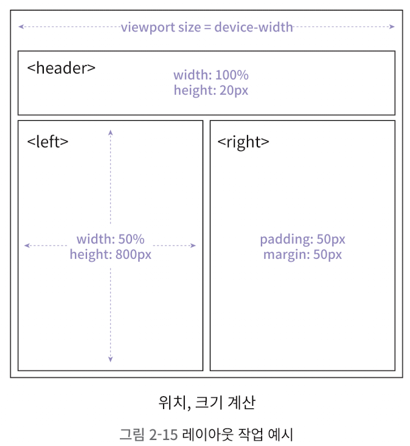
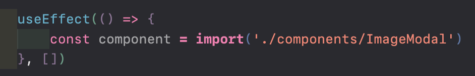

export NODE_OPTIONS=--openssl-legacy-provider

npm run start

# 2장 

# 올림픽 통계 서비스 최적화

### 컴포넌트 지연 로딩

- 1장의 코드 분할에서는 페이지 코드 자체를 분할했음
- 여기서는 '단일 컴포넌트'를 분할 -> 컴포넌트가 사용되는 순간 불러옴

### 컴포넌트 사전 로딩

- 컴포넌트 지연 로딩을 통해 첫 화면을 더 빠르게 그릴 수 있지만, **다운로드되어 있지 않은 코드를 추가로 다운로드하는 시간만큼 서비스 이용에 지연 발생**
- 따라서,

  1. 코드를 분할 -> 첫 화면 진입 시에는 다운로드 X
  2. 이후 해동 코드가 필요한 시점보다는 먼저 코드를 로드

    => **컴포넌트 사전 로딩**을 통해 해당 코드를 지연 없이 사용할 수 있음!
- 

### 이미지 사전 로딩

- 이미지도 마찬가지로, 이미지가 필요한 시점보다 먼저 다운로드해 두고, 필요할 때 바로 이미지를 보여줄 수 있도록 구현

## 서비스 탐색 및 코드 분석

- 이미지가 늦게 열리거나, 그래프 애니메이션이 뚝뚝 끊기는 그런 것들 해결해보자

## 애니메이션 최적화

### 문제의 애니메이션 찾기

- 애니메이션 적용 부분: 막대 그래프의 배경색과 가로길이 변화 <- 살짝씩 끊기는 듯한 느낌 듦
- **jank**: 끊김 현상
- 애니메이션을 일으키는 속성은 transition이 적용된 width뿐인데, 왜 이런 jank가 발생할까?

### 애니메이션의 원리

- 여러 장의 이미지를 빠르게 전환 -> 잔상 -> 연속된 이미지가 움직이는 것처럼 느껴지게 함
- 브라우저는 1초에 60FPS(Frame Per Second), 즉 60장의 화면을 새로 그림
- 따라서, janking이 발생했다는 건 브라우저가 정상즉으로 60FPS 화면을 그리지 못했다는 뜻
    - 예를 들어, CPU가 바빠서 40FPS, 20FPS 이렇게 동작할 수도 있음

### 브라우저 렌더링 과정

왜 브라우저가 60FPS를 그리지 못할까? 브라우저가 화면을 그리는 과정에 대해 알아보자

- 브라우저는 아래 사진의 과정을 거쳐 화면을 그림
- 아래 과정을 Critical Rendering Path 또는 Pixel Pipeline이라고 함


1. DOM + CSSOM

- HTML 파일, CSS 등 화면을 그리는데 필요한 리소스 다운로드 -> 브라우저가 이해할 수 있는 형태로 parsing하는 과정 -> DOM(요소 간의 관계가 tree 구조로 표현됨)이 생성됨
- CSS도 HTML과 비슷한 과정을 거쳐 브라우저가 이해할 수 있는 형태로 변환됨, CSSOM(CSS Object Model)이라는 트리 구조가 생성됨

2. 렌더 트리

- DOM과 CSSOM의 결합으로 생성됨
- 화면에 표시되는 각 요소의 레이아웃을 계산하는데 사용됨
    - display: none;으로 설정돼서 화면에 표시되지 않으면 렌더 트리에 포함되지 않음


3. 레이아웃

- 화면 구성 요소, 위치, 크기를 계산하고, 해당 위치에 요소를 배치함
- 걍 말 그대로 화면의 레이아웃을 잡는 과정



4. 페인트

- 화면에 배치된 요소에 색을 채워넣음(배경색, 글자색, 테두리색 등)
- 브라우저는, 효율적인 페인트 과정을 위해 구성 요소를 여러 개의 Layer로 나눠서 작업

5. composite

- 각 레이어를 합성하는 작업
- 4단계에서 나눈 레이어를 하나로 합성하는 과정
- Reflow/Repaint
    - 화면이 모두 그려진 후 애니메이션에 의해 일부 스타일이 변경, 추가, 제거됨 -> critical rendering path에서 거친 과정을 다시 한 번 실행, 새로운 화면을 그리는 과정

    

### 리플로우와 리페인트

- reflow
    - 화면이 모두 그려진 후, JS로 인해 컴포넌트의 너비와 높이가 변경된 상황 -> 브라우저는 해당 요소의 가로와 세로를 다시 계산, 화면에 새로 그림

1. 스타일이 변했으므로 CSSOM 새로 생성
2. 변경된 CSSOM으로 새로운 렌더 트리 생성
3. 레이아웃에서 요소의 크기 위치 다시 고려(크기가 변했으니까)
4. 변경된 구성에 맞춰 다시 페인트
5. 분할된 레이어를 다시 composite

- 즉, reflow는 critical rendering path의 모든 단계를 모두 재실행, **브라우저 리소스 많이 사용함**
- repaint
- 만약 가로, 세로 등 '크기'가 아니라 '색'이 바뀐다면?

    => 레이아웃 단계는 실행되지 않음(요소의 위치나 크기가 변하지 않았으므로)

    => critical rendering path에서 '레이아웃' 단계 제외하고 모두 실행
- reflow보다는 좀 더 빠르지만, repaint도 역시 리소스 꽤 잡아먹음

> 해결 방법 없을까?

### 하드웨어 가속(GPU 가속)

CPU에서 처리할 작업을 GPU에 위임해 더 효율적으로 처리하는 방법

- GPU: 애초에 그래픽 작업을 위해 만들어졌으므로 화면을 그릴 때 활용하면 굉장히 빠름!
- 요소에 하드웨어 가속 적용 방법:
    - 요소를 별도의 레이어로 분리해 GPU로 보내기

    how? -> transform 속성과 opacity 속성으로!

    **분리된 레이어는 GPU에 의해 처리돼 레이아웃 단계와 페인트 단계 없이 화면상의 요소 스타일을 변경할 수 있음**

    => reflow, repaint를 일으키는 width, height, color 등의 속성이 아닌 **transform, opacity 속성을 이용한 애니메이션이 성능이 더 좋다!!**

### 다시 그래프 애니메이션으로 돌아가보자!

설문 결과의 막대 그래프에서 width를 변경해 애니메이션 효과를 줌 => width가 변할 때마다 reflow 발생 => 브라우저 무리, jank 발생!

- 확인 방법: Performance 패널에서 CPU를 '6x slowdown'으로 설정해서 '기록' 버튼 누르고 확인해보면,


이렇게 reflow로 인해 화면을 1/60초 안에 그리지 못함을 확인할 수 있음

=> **GPU를 활용해 레이아웃 단계와 페인트 단계를 건너뛸 수 있는 transform같은 속성을 사용해!**

### 애니메이션 최적화

width로 돼있는 애니메이션을 transform으로 변경하고 최적화해보자.

- transform 속성
    - translate: 위치 이동
    - scale: 크기 변경 <- 여기서는 scale 비율로 너비 변경
    - rotate: 요소 회전

    ...

- 이렇게 transform을 이용해 애니메이션을 적용하면 성능이 더 좋아지고 1/60초 안에 리렌더링이 진행됨을 확인할 수 있음!

## 컴포넌트 지연 로딩

### 번들 파일 분석

- cra-bundle-analyzer를 설치하고 2.chunk.js 번들파일 내용을 확인해보면 react-image-gallery라는 라이브러리가 있는 걸 확인할 수 있음 <- 이 라이브러리는 서비스 첫 화면부터 필요하지 않음/사진 갤러리 모달창이 뜰 때 띄우면 됨

### 모달 코드 분리하기

페이지 분할과 마찬가지로, 특정 컴포넌트를 lazy로 선언하고 Suspense 컴포넌트로 해당 컴포넌트를 감싸면 됨(p.91)

```js
// 생략
const LazyImageModal = lazy(() => import('./components/ImageModal'))

function App() {
    const [showModal, setShowModal] = useState(false)
    return (
        <div className="App">
            <Suspense fallback={null}>
                {showModal ? <LazyImageModal closeModal={() => { setShowModal(false) }} /> : null}
            </Suspense>
        </div>
    )
}
```

## 컴포넌트 사전 로딩

### 지연 로딩의 단점
- 장점: 최초 페이지를 로드할 때 당장 필요 없는 모달과 관련된 코드가 번들에 포함되지 않아, 로드 파일 크기가 작아지고 초기 로딩 속도/JS 실행 타이밍이 빨라져 화면이 더 빨리 표시됨
- 단점: 초기 화면 로딩 시에는 효과적이지만, 결국 이후 해당 코드가 필요한 시점에는 코드를 로드해야 하므로 그 시점에 약간의 지연이 발생함

- 해결방안: **사전 로딩(Preloading)**, 나중에 필요한 모듈을 필요해지기 전에 미리 로드하는 기법
    - 모달 예시
        모달 코드가 필요한 시점은 사용자가 '올림픽 사진 보기' 버튼을 클릭한 시점
        => 사용자가 버튼을 클릭하기 전에 미리 모달 코드를 로드해둘까?
        => 근데 사용자가 버튼을 언제 클릭할 지도 모르는데, 모달 코드를 언제 미리 로드해둬?
        1. 사용자가 버튼 위에 마우스를 올려놨을 때(mouseenter)
        2. 최초 페이지가 로드된 후 모든 컴포넌트의 마운트가 끝났을 때

### 컴포넌트 사전 로딩 타이밍
1. 버튼 위에 마우스를 올려놓았을 때 사전 로딩
- Button 컴포넌트의 onMouseEnter 이벤트로 마우스가 버튼에 올라온 시점에 ImageModal 로드


### 컴포넌트의 마운트 완료 후 사전 로딩
- 만약 모달 컴포넌트 크기가 커서 로드하는데 1초 이상(오래) 걸린다 -> 그럼 마우스 커서를 버튼에 올리는 시점보다 더 먼저 파일을 로드해야 함 => '올림픽 사진 보기' 버튼을 포함하는 페이지가 모두 마운트된 후에, 브라우저에 여유가 생겼을 때 뒤이어 모달을 추가롤 로드하는 방식
- 즉 **useEffect 시점**에 모달 컴포넌트를 로드하면 됨!

이렇게 하고 다른 부분은 위 이미지와 동일 
