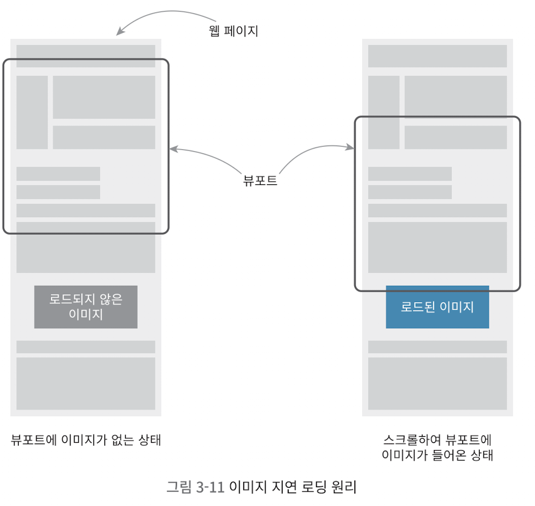

# 홈페이지 최적화

## 이미지 지연 로딩

### 네트워크 분석

- throttling 적용
    - throttling 옵션에서 Fast 3G, Slow .. 등 선택 가능
    - Custom throttling option도 추가 가능(throttling 옵션의 'Add')
- 페이지 리소스 다운로드 순서(네트워크 탭)

  1. bundle파일
  2. 이미지와 폰트
  3. banner-video <- 페이지에서 가장 처음 보이는 콘텐츠인데 가장 나중에 로드되는 문제 발생

     => 당장 사용 안되는 이미지를 나중에 다운로드, 동영상을 먼저 다운로드하도록 순서 바꿔야 함

     => 즉, 이미지를 지연 로드!

     => 이미지가 화면에 보이는 순간 or 그 직전에 로드하면 됨

     

### Intersection Observer

- 이미지를 지연로딩 하는 방법
- 스크롤이 이동했을 때 해당 뷰포트에 이미지를 보이게 할 지 판단하면 됨 <- 하지만 scroll 이벤트에 이걸 넣으면 로직 발생 횟수 많아짐

  ```js
  window.addEventListener('scroll', ~~)
  ```

  => **'Intersection Observer'** 사용
- Intersection Observer
    - 브라우저에서 제공하는 API
    - 웹 페이지의 특정 요소를 observe, 페이지 스크롤 시 해당 요소가 화면에 들어왔는지 아닌지 알려줌, 즉 요소가 화면에 들어왔을 때'만' 함수를 호출

```js
const options = {
  root: null, // 대상 객체의 가시성(null: 브라우저의 뷰포트)
  rootMargin: "0px", // root의 가시범위 가상으로 확장, 축소
  threshold: 1.0, // 대상 요소가 어느 정도로 보일 때 콜백 실행할 지 결정
};

const callback = (entries, observer) => {
  console.log("Entries", entries);
};
const observer = new IntersectionObserver(callback, options);
obserever.observe(document.querySelector("#target-element1"));
```

### Intersection Observer 적용하기

- video 아래에 나란히 렌더링되는 이미지 3장에 지연 로딩을 적용해보자

  1. 이미지가 적용되는 요소를 포함하는 컴포넌트에 Intersection Observer 적용하기 <- 뷰포트에 이미지가 나타나는 시점 확인 가능
  2. 화면에 이미지가 보이는 순간 이미지를 로드하기 <- 최초에는 img 태그에 src값을 할당하지 않다가 콜백이 실행되는 순간 src 할당

  이때, Intersection Observer를 'useEffect' 안에서 생성하는게 효율적
    - useEffect를 사용하지 않으면 렌더링할 때마다 인스턴스가 생성되고, 대상 요소를 관찰하게 됨 -> 여러 개의 콜백이 실행됨(중복 발생)
    - useEffect의 cleanup 함수에서 'observer.disconnect' 메서드도 구현 -> 뷰포트에 나타난 걸 확인한 뒤에는 바로 disconnect해서 리소스 낭비 방지

  => 이제 이미지가 뷰포트에 나타나는 시점을 확인할 수 있음!

  => 다음으로는 이미지가 보이는 시점에(콜백이 실행되는 시점에) 이미지를 로드해보자!

  ** 이미지 지연 로딩 **

1. 최초에는 img 태그에 src 값을 할당하지 않다가(data- 속성 이용)
2. 콜백이 실행되는 순간 img 태그에 src를 할당함으로써 이미지 지연 로딩 적용

```js
	const imgRef = useRef(null)

	useEffect(() => {

		const options = {}
		const callback = (entries, observer) => {
			entries.forEach(entry => {
				if(entry.isIntersecting) {
				 console.log('is intersecting', entry.target.dataset.src)
				 entry.target.src = entry.target.dataset.src
				 observer.unobserve(entry.target)
				}
			})
		}

		const observer = new IntersectionObserver(callback, options)
		observer.observe(imgRef.current)
		return () => observer.disconnect()
	}, [])
```

```js
<picture>
	<source data-srcset={props.webp} type='image/webp' />
	
</picture>
```

## 이미지 사이즈 최적화

### 느린 이미지 로딩 분석

- 이미지 지연로딩 시 스크롤이 이미지 위치에 도달하는 순간 로드함 -> 전체 이미지가 바로 보이지 않고 천천히 로드됨
- 이미지 사이즈 최적화로 다운로드 시간 줄여야 함

### 이미지 포맷 종류

- 이미지 최적화: 이미지 가로, 세로 사이즈를 줄여 이미지 용량을 줄이고 더 빠르게 다운로드하는 기법
- 이미지 포맷
    - PNG: 무손실 압축 방식, 원본 훼손 없이 압축, 알파 채널(투명도) 지원
    - JPG(JPEG): 손실 압축, 더 작은 사이즈로 줄 일 수 있음
    - WebP: 무손실/손실 압축 모두 제공, PNG와 JPG보다 훨씬 효율적, 브라우저 호환성은 상대적으로 낮음

### Sqoosh를 사용한 이미지 변환

- JPG/PNG -> WebP로 변환 실습, converter: 'Squoosh' 사용
- Squoosh: from 구글, 별도의 프로그램 설치x, 웹엥서 이미지를 여러 포맷으로 변환 가능
    - resize: 이미지 가로 세로 너비 조정
    - compress: 압축 방식(WebP 등), 압축률(70~80 권장)

  => 다운로드 및 프로젝트에 이미지 적용

- picture 태그
    - 다양한 타입의 이미지를 렌더링하는 컨테이너 -> WebP의 호환성 문제 해결(해당 브라우저에서 지원하는 타입의 이미지를 찾아 렌더링)
- 사용 예시
    - ```js
      const imgEl1 = useRef(null); // DOM 조작
      useEffect(() => {
        const options = {};

        const callback = (entries, observer) => {
          entries.forEach((entry) => {
            if (entry.isIntersecting) {
              // 이미지가 뷰포트에 들어갔는지 확인
              const sourceEl = entry.target.previousSibling;
              // entry.target: 'img'태그, previousSibling이므로 sourceEl은 'source'
              // 'picture' 태그(img보다 더 넓은 브라우저 호환성)에 src 설정
              sourceEl.srcset = sourceEl.dataset.srcset;
              // source의 src 세팅
              entry.target.src = entry.target.dataset.src;
              // img의 src 세팅(브라우저에서 source의 이미지 형식 지원하지 않을 시 img에 설정된 src로 이미지 렌더링
              observer.unobserve(entry.target);
            }
          });
        };

        let observer = new IntersectionObserver(callback, options);
        observer.observe(imgEl1.current);
      });
      ```