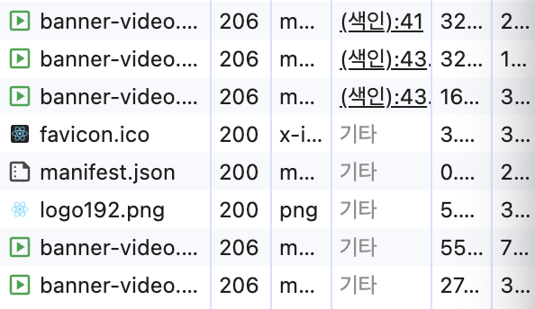
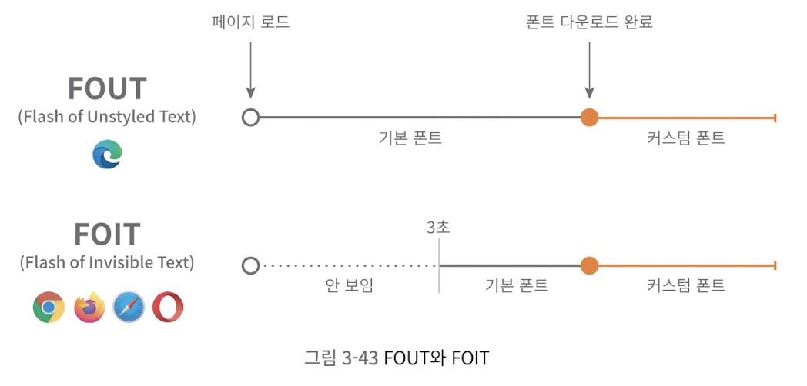
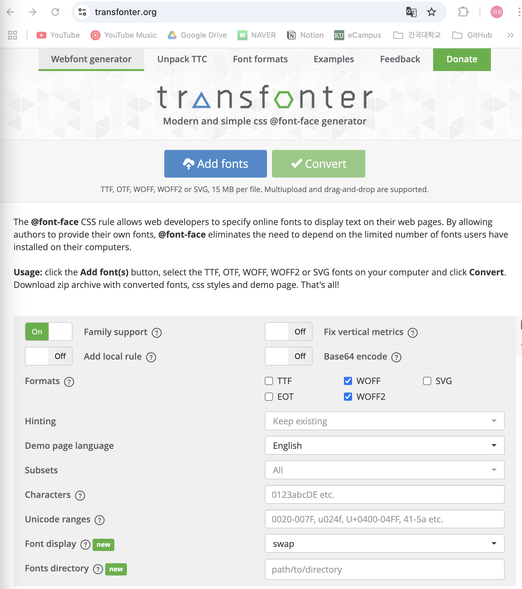
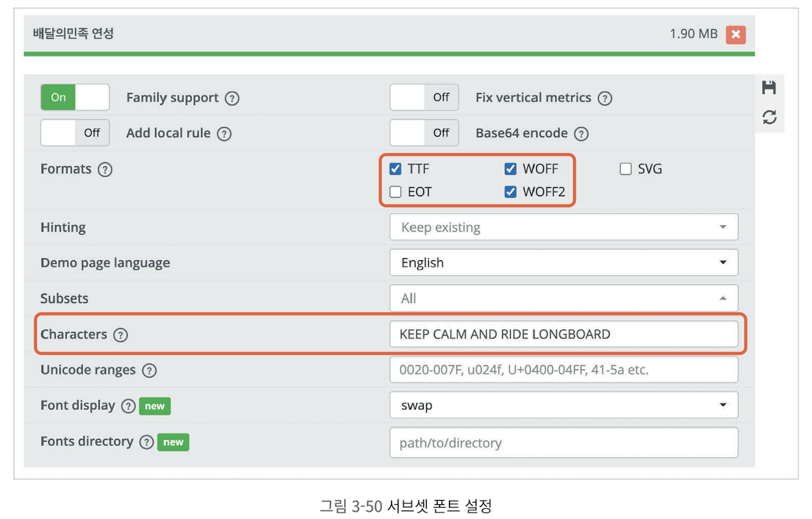
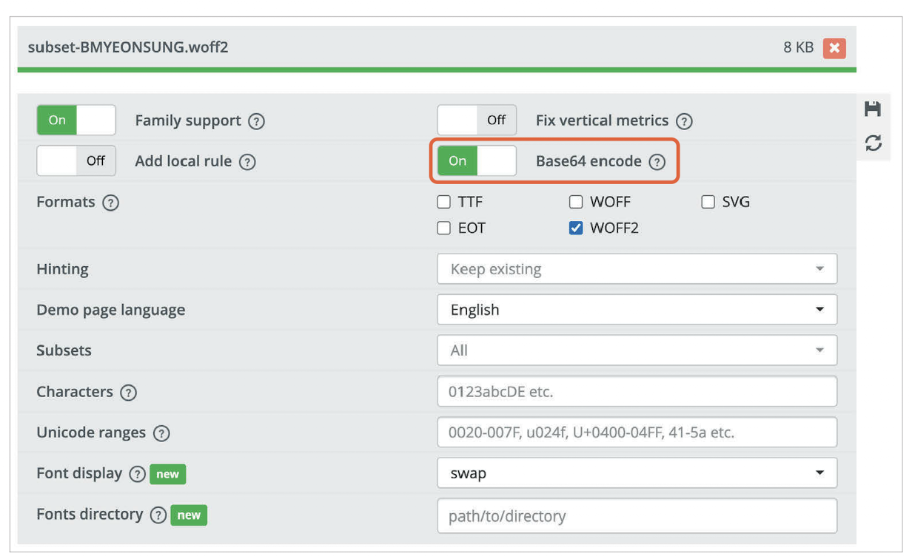
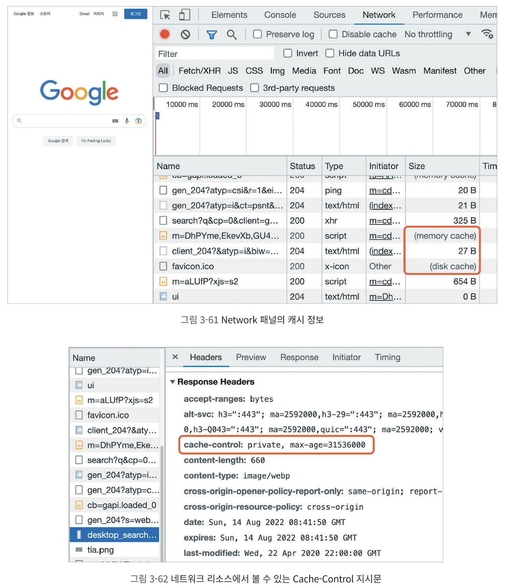
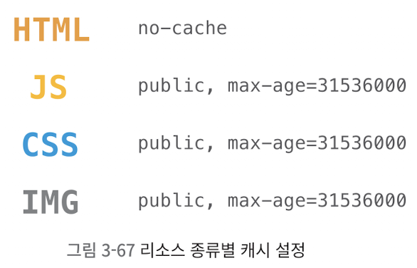
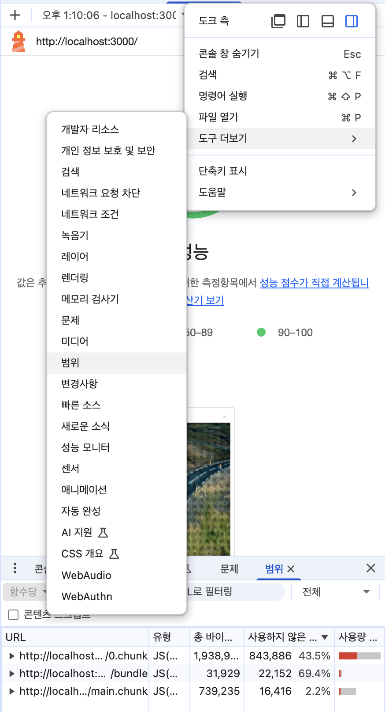

## 동영상 최적화

### 동영상 콘텐츠 분석



- 네트워크 탭에서 동영상 확인해보면 다운로드 요청이 여러 개로 나뉘어 있는데, 파일의 크기가 크기 때문에 당장 재생이 필요한 부분 먼저 다운로드, 순차적으로 나머지 내용 다운로드함
- 이렇게 나눠도, 애초에 파일의 크기가 크므로 재생까지 오래 걸림
- 동영상 파일의 크기도 54MB로 웹에서 사용하기에는 큼 

=> 최적화 들어가자!

### 동영상 압축

이미지 최적화와 비슷하게,

- 가로 세로 줄이고 압축 방식 변경 등, 단 화질이 낮아짐
- 동영상 편집 프로그램이나 동영상 최적화 서비스 제공 사이트 이용하기
- Media.io 이용 동영상 최적화
    - 동영상 파일 확장자를 WebM으로 선택(이미지의 WebP와 같음)
    - Bitrate 가장 낮게(512Kbps), Audio 체크 해제

    그리고 다운로드하기

### 압축된 동영상 적용

- WebP 이미지를 적용했을 때 브라우저 호환성을 고려해서 img 태그 대신 picture 태그를 사용했었음
- WebM도 마찬가지로, 'video'태그를 사용해 코드 작성하기
- ```js

<video src={video} className="" autoPlay loop muted>
	<source src={video} type="video/webm"/>
</video>
  ```

- 동영상 최적화 후 발생하는 화질 저하 방지 팁
    - 패턴과 필터 이용하기

      패턴이나 필터로 영상을 가리기

      

      아님 사실 blur도 되게 효과적(굳이 동영상을 그대로 보여주지 않아도 될 때)

## 폰트 최적화

- Network 패널에서 폰트 확인 <- 파일 크기 750kB, 다운로드 약 5초 후부터 적용됨 => UX에 안좋음!

### FOUT, FOIT

- FOUT(Flash of Unstyled Text) 또는 FOIT(Flash of Invisible Text)라고 부르는 폰트가 변화하는 현상 발생
- FOUT

    Edge 브라우저 방식, 폰트 다운로드 여부와 상관없이 텍스트 보여주고, 폰트가 다운로드 되면 그때 폰트를 적용함
- FOIT

    크롬, 사파리 등에서 폰트를 로드하는 방식, 폰트가 완전히 다운로드 되기 전까지 텍스트 자체를 보여주지 않음

    엥 근데 크롬에서 폰트 다운로드 되기 전에도 텍스트 보이는데? <- 완전한 FOIT가 아니라 3초만 기다리는 FOIT, 즉 3초동안은 폰트 다운로드 기다리다가 3초때까지 안되면 기본 폰트로 텍스트를 보여줌, 그 뒤 폰트 다운로드 시 해당 폰트 적용



방식에 우열은 없지만, 어쨌든 폰트 최적화로 폰트때문에 발생하는 깜빡임을 줄여야 함

FOUT: 중요한 텍스트(뉴스 제목 등) 렌더링에 사용하면 유리함

FOIT: 사용자에게 꼭 전달하지 않아도 되는 텍스트는 FOUT으로 구현하면 사용자의 시선을 분산시킴, FOIT이 나을 것

### 폰트 최적화 방법 두 가지

- 폰트 적용 시점 제어

    CSS의 font-display 속성
    - 폰트가 적용되는 시점 제어 가능, @font-face에서 설정 가능
    - auto
    - block: FOIT(timeout 3초)
    - swap: FOUT
    - fallback: FOIT(timeout 0.1초), 3초 후에도 못불러오면 기본 폰트 유지, 이후 다운로드 되면 캐싱 처리, 즉 페이지 재로드 시 바로 폰트 적용됨
    - optional: FOIT(timeout 0.1초), 3초 후에도 못불러오면 이후 네트워크 상태에 따라 기본 폰트로 유지할지 결정, 이후 다운로드 되면 캐싱 처리
    - ```css
       @font-face {
      	font-family: BMYEONSUNG;
      	src: url('./assets/fonts/BMYEONSUNG.ttf');
      	font-display: fallback;
      }
      ```
    - 중요하지 않은 텍스트는 3초 뒤에 등장하는게 딱히 상관은 없지만, 갑자기 빢 등장하면 부자연스러움 -> fade-in 애니메이션 적용해보기
    - 폰트가 다운되기 전에는 일반 텍스트, 다운되면 fade-in 효과와 함께 폰트가 적용된 텍스트가 나타남
- ```js
   import FontFaceObserver from "fontfaceobserver";
      const font = new FontFaceObserver("BMYEONSUNG");
      function BannerVideo() {
          useEffect(() => {
          // fontfaceobserver로 폰트 다운로드 여부 확인
  	    font.load(null, 20000).then(function () {
          console.log("BMYEONSUNG has loaded");
      });
    }, []);
  ```
- **폰트 파일 크기 줄이기**
- 폰트 파일 크기를 줄이는 두 가지 방법
    - 압축률 좋은 폰트 포맷 사용하기
        - 폰트 포맷: 일반적으로, 운영체제에서 사용하는 TTF 및 OTF
        - TTF: 파일 크기가 매우 큼, 매번 리소스를 다운로드해야 하는 웹 환경에서는 적절하지 않음
        - WOFF: Web Open Font Format, 웹을 위한 폰트 -> TTF 폰트를 압축, 더 빠르게 로드 가능, 최근엔 WOFF2라는 더욱 향상된 방식도 등장함

        

- 하지만 WOFF, WOFF2도 WebP처럼 브라우저 호환성 문제 있음, 따라서 지원 안되는 브라우저에 대한 대비 필요
- transfonter 사이트에 폰트를 올리고 WOFF, WOFF2 선택해서 convert하면 됨

    

    => 변환 후 파일 크기가 TTF > WOFF > WOFF2 인 것을 확인할 수 있음
- 이제 App.css의 @font-face를 수정해보자
- ```css
  @font-face {
  	font-family: BMYEONSUNG;
  	src: url('./assets/fonts/BMYEONSUNG.woff2') format('woff2'),
  	url('./assets/fonts/BMYEONSUNG.woff') format('woff'),
  	url('./assets/fonts/BMYEONSUNG.ttf') format('truetype');
  	font-display: block;
  }
  ```
- **필요한 문자의 폰트만 로드하기**

woff2의 447KB도 너무 큼... 근데 사실 모든 문자의 폰트 정보를 가지고 있을 필요가 없잖아?

- **subset 폰트**

Transfonter 서비스에서 생성 가능, 'characters'에 폰트를 적용할 문자를 넣으면 해당 문자에 대한 subset font가 생성됨



=> 폰트 파일 크기가 10KB, 8KB로 엄청 줄어듦!

- 더 나아가서!
- 폰트를 파일 형태가 아닌 **Data-URI 형태로 CSS파일에 포함**할 수도 있음
    - 파일을 문자열 형태로 변환해서 문서(HTML, CSS, JS 등)에 인라인으로 삽입하는 것
    - 기존: App.css 파일이 로드된 후 폰트 적용을 위해 폰트 파일을 추가로 로드 
    - Data-URI: 별도의 네트워크 로드 없이 App.css에서 폰트 사용 가능
- 사용 방법
    - 아까처럼 Transfonter 접속

    WOFF2든 WOFF든 TTF든, 폰트 업로드하고, **Base64 encode** 옵션을 On으로 설정하기

    

- 단, 폰트 내용이 App.css에 포함된 것이므로 App.css의 다운로드 속도가 저하됨(App.css는 main.chunk.js에 포함되어 빌드됨)
- 또한, 여기서는 subset-font를 Data-URI로 만들었으므로 파일 크기가 작지만 폰트 파일 자체의 크기가 크면 Data-URI의 크기도 커져 또다른 병목 발생 가능

## 캐시 최적화

- Network 패널에서 리소스를 암거나 하나 골라 확인해보면, 대부분 응답 헤더에 캐시에 대한 설정인 Cache-Control이라는 헤더가 없음을 알 수 있음

### 캐시란?

- 자주 사용하는 데이터나 값을 미리 복사해 둔 임시 저장 공간
- 캐시의 종류
    - 메모리 캐시: 메모리(RAM)에 저장하는 방식
    - 디스크 캐시: 파일 형태로 디스크에 저장하는 방식

    어떤 캐시를 사용할 지는 제어할 수 없음(브라우저가 사용 빈도나 파일 크기에 따라 자기 알고리즘으로 알아서 처리)

* 캐시를 확인할 때는 Network 패널의 Disable cache 설정을 꺼야 함!
* Cache-Control 속성은 서버에서 설정하며, 이를 통해 브라우저는 해당 리소스를 얼마나 캐시할지 판단함




### Cache-Control

리소스의 응답 헤더에 설정되는 헤더

### 적절한 캐시 유효 시간

- 리소스마다 사용이나 변경 빈도가 다르므로, 캐시의 유효 시간도 달라야 함
- 일반적으로 HTML 파일에는 no-cache 사용 <- 항상 최신 버전의 웹서비스 제공을 위해, HTML이 캐시되면 캐시 기간동안 최신 버전의 리소스 제공을 하지 못함
- JS와 CSS는 파일명에 해시값을 가지고 있으므로, 코드가 변경되면 해시도 변경되어 완전히 다른 파일이 되어버림 => 캐시를 아무리 오래 적용해도, HTML만 최신 상태라면 JS나 CSS, 이미지 등은 최신 리소스를 로드하게 됨
- ```js
  const header = {
    setHeaders: (res, path) => {
      if (path.endsWith(".html")) {
        res.setHeader("Cache-Control", "no-cache");
      } else if (
        path.endsWidth(".js") ||
        path.endsWith(".css") ||
        path.endsWith(".webp")
      ) {
        res.setHeader("Cache-Control", "public, max-age=31536000"); // 1년
      } else {
        res.setHeader("Cache-Control", "no-store");
      }
    },
  };
  ```
  이런 식으로 경로에 따라 캐시 기간 설정 가능


## 불필요한 CSS 제거
- Lighthouse 검사 -> Opportunities -> 'Reduce unused CSS'
- 더 자세히 확인하기 위해 Coverage 패널을 확인해보자
- Coverage
    - 페이지에서 사용하는 JS 및 CSS 리소스에서 실제로 실행하는 코드가 얼마나 되는지와 그 비율을 표시해줌
    
    사진의 '범위' 클릭하면 됨
    - '사용하지 않은 바이트'에 unused byte 비율이 꽤 높은 것을 확인할 수 있음
- 먼저 JS부터 봐보자
    - JS 리소스인 2.chunk.js 파일을 'Coverage 패널의 기록이 진행 중인 상태에서' 확인해보면, 처음에는 unused가 39%였다가 점점 줄어드는 것을 볼 수 있음 <- JS의 if문 등에 의해 실행되는 코드 비중이 증가하기 때문
- CSS는 JS와 달리 별 분기가 없음
    - 이런건 PurgeCSS라는 툴을 이용해 없앨 수 있다!