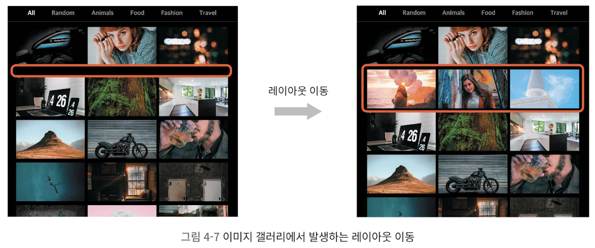
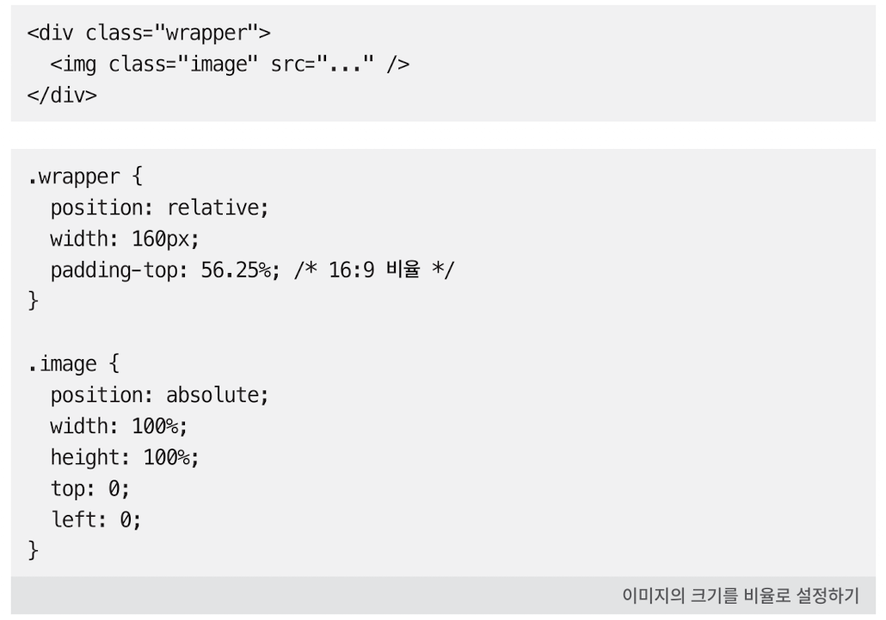
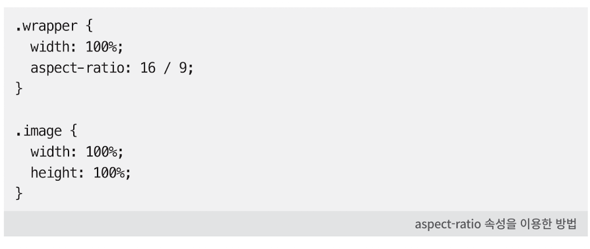
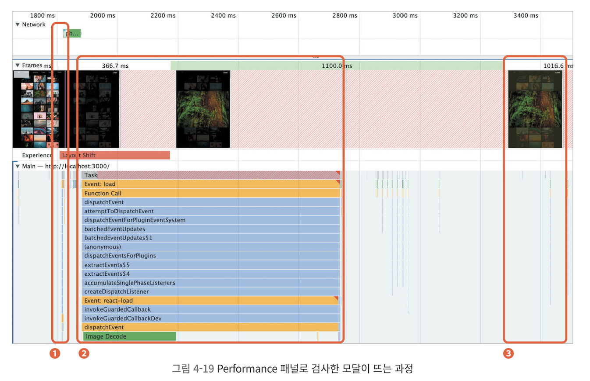

# 이미지 갤러리 최적화

## 레이아웃 이동 피하기

### 레이아웃 이동이란?

레아이웃 이동: 화면상의 요소 변화로 레이아웃이 갑자기 밀리는 현상



이 사진과 같이, 아래 이미지보다 늦게 로드된 이미지가 뒤늦게 아래 이미지를 '밀어내면서' 화면에 그려짐

-> 위치를 순간적으로 변경시키며, 의도와 다른 클릭 유발 가능

=> ** UX에 좋지 않다!**

Lighthouse의 'CLS(Cumulative Layout Shift)' 항목으로 성능 테스트 가능

0점: 레이아웃 이동이 전혀 발생하지 않음

1점: 그 반대

권장: 0.1점 이하

Lighthouse-Performance-Experience섹션의 'Layout Shift'(빨간 막대)에서 레이아웃이 발생한 원인(레이아웃 이동을 유발한 요소) 확인 가능

### 레이아웃 이동의 원인

- 사이즈가 미리 정의되지 않은 이미지 요소
- 사이즈가 미리 정의되지 않은 광고 요소
- 동적으로 삽입된 콘텐츠
- 웹 폰트(FOIT, FOUT)

이 갤러리는 '사이즈가 미리 정의되지 않은 이미지 요소'때문에 레이아웃 이동이 발생함

### 레이아웃 이동 해결

레이아웃 이동을 일으키는 요소의 사이즈를 지정하면 됨

이 이미지 갤러리의 이미지 사이즈는 브라우저의 가로 사이즈에 따라 변하므로, 이미지의 너비 높이 비율로 공간을 잡아두면 됨(16:9)

- 이미지 크기를 비율로 설정하는 방법
    - padding으로 박스를 만든 뒤, 그 안에 이미지를 absolute로 띄우는 방식

    

    이 상태에서 이미지를 absolute로 넣어 주면 부모 요소인 div와 사이즈가 동일해짐

    하지만 이 방법은 padding 퍼센트 매번 계산 필요, 코드가 직관적이지 않음

- aspect-ratio css속성 사용

    

    aspect-ratio 속성에 비율만 명시해주면 되고, 자식 요소인 이미지에 absolute를 적용할 필요도 없음

    하지만 상대적으로 최신 기술이므로 브라우저의 일부 버전에서 지원하지 않을 수도 있음

```typescript
function PhotoItem({ photo: { urls, alt } }) {
  return (
    <ImageWrap>
      <Image src={urls.small + '&t=' + new Date().getTime()} alt={alt} onClick={openModal} />
    </ImageWrap>
  );
}

const ImageWrap = styled.div`
  width: 100%;
  padding-bottom: 52.65%;
  position: relative;
`;

const Image = styled.img`
  cursor: pointer;
  width: 100%;
  position: absolute;
  height: 100%;
  top: 0;
  left: 0;
`;

export default PhotoItem;
```

+) padding에 %로 값을 주면 항상 부모의 width 기준으로 계산됨, 따라서 위 코드의 padding-bottom: 52.65%도, ImageWrap의 width가 100%이므로 height는 52.65%인 16:9의 가로세로 비율이 만들어짐

## 이미지 지연 로딩

- 적용 방법
    - Intersection Observer API(스크롤해서 해당 이미지가 나타날 때 로딩)
    - react-lazyload 라이브러리 이용

```typescript
import LazyLoad from 'react-lazyload';

function PhotoItem({ photo: { urls, alt } }) {
  return (
    <ImageWrap>
      <LazyLoad>
        <Image src={urls.small + '&t=' + new Date().getTime()} alt={alt} onClick={openModal} />
      </LazyLoad>
    </ImageWrap>
  );
}
```

이렇게 원하는 부분을 LazyLoad로 감싸주기만 하면 됨!

- 이미지가 지연로드되므로 초기화면의 리소스를 절약할 수 는 있지만,
- 스크롤을 내려 화면에 이미지가 들어올 때 이미지를 로드하므로 처음에는 이미지가 보이지 않고 시간이 지나야 이미지가 보임

=> 이미지가 화면에 들어오는 시점보다 조금 더 미리 이미지를 불러오자!

- react-lazyload 라이브러리에서 옵션 제공
    - offset값

      얼마나 미리 이미지를 로드할지 픽셀 값으로 넣어줌

      ex: 100으로 설정하면 화면에 들어오기 100px 전에 이미지 로드

      <LazyLoad offset={1000}>
      이렇게 LazyLoad에 props로 넣어주면 됨

## 리덕스 렌더링 최적화

### 리액트의 렌더링

- 리액트는 렌더링 사이클을 가짐
- 렌더링에 시간이 오래 걸리거나, 렌더링하지 않아도 되는 컴포넌트에서 불필요하게 리렌더링이 발생 => 메인스레드의 리소스를 차지해 성능에 영향을 줌

=> 따라서 React Developer Tools로 이미지 갤러리 서비스 분석할 것!

- React Developer Tools
    - 이미지 갤러리 서비스에서 리렌더링이 발생하는 상황 파악
    - 해당 리렌더링이 불필요한 리렌더링인지 파악

    +) 크롬 확장에서 설치하면 되는데, 만약 설치 후에도 개발자 모드에서 Components와 Profiler가 안보인다면 개발자 모드에서 '설정' 톱니바퀴 버튼 누르고 'Preference'탭 가장 우측 아래에 'Restore defaults and reload' 버튼 누르면 됨

- Components패널의 'Hilight updates when components render'를 클릭하면 어떤 요소들이 리액트 렌더링 사이클에 의해 리렌더링 되는지 확인할 수 있음

### 리렌더링의 원인

- Redux에 의해 불필요한 리렌더링이 발생할 수 있음

    리덕스 상태를 구독하는 컴포넌트는, 리덕스 상태에 따라 불필요하게 리렌더링 될 수 있음
    - useSelector

        서로 다른 상태를 참조할 때는 리렌더링을 하지 않음(useSelector에 인자로 넣은 함수의 반환값 기준)

        반환값이 이전과 같으면 리렌더링 X, 다르면 리렌더링
- 해결 방법

1. 객체를 새로 만들지 않도록 반환값을 나누는 방법

```typescript
  // const { modalVisible, bgColor, src, alt } = useSelector(state => ({
  //   modalVisible: state.imageModal.modalVisible,
  //   bgColor: state.imageModal.bgColor,
  //   src: state.imageModal.src,
  //   alt: state.imageModal.alt,
  // }));

  const modalVisible = useSelector(state => state.imageModal.modalVisible);
  const bgColor = useSelector(state => state.imageModal.bgColor);
  const src = useSelector(state => state.imageModal.src);
  const alt = useSelector(state => state.imageModal.alt);
```

기존 위와 같던 코드를 아래와 같이 변경해, 다른 상태 변화에 영향을 받지 않도록 설정

2. Equality Function을 사용하는 방법

useSelector에 equality function을 옵션으로 넣어, 이전 반환값과 현재 반환값을 비교해 리렌더링을 결정할 수 있음

```typescript
const { modalVisible, bgColor, src, alt } = useSelector(state => ({
    modalVisible: state.imageModal.modalVisible,
    bgColor: state.imageModal.bgColor,
    src: state.imageModal.src,
    alt: state.imageModal.alt,
  }),
    shallowEqual // Redux 제공, 객체 얕은 비교 함수(객체 내부의 값 직접 비교)
  );
```

## 병목 코드 최적화

### 이미지 모달 분석

- 페이지 최초 로드 시, 카테고리 변경 시
- 이미지 모달 띄울 시



1. 이미지 클릭 -> 이미지 모달이 뜸
2. 이미지가 모두 다운로드되면 2번으로 넘어감

    Image Decode(drawImage함수의 하위 작업)이 끝나고
3. 새롭게 렌더링되면서 변경된 배경화면이 화면에 보임

### getAverageColorOfImage 함수 분석

- canvas에 이미지를 올리고 pixel정보를 하나씩 더해 평균을 냄 -> 큰 이미지 사용 + 반복문 == 느림
- 해결:

1. 함수의 Memoization

    한 번 실해된 함수에 대해 반환값을 기억, 같은 조건으로 실행되면 이전에 기억해둔 값을 반환하는 기술

    '같은 조건' == '같은 인자'

    여기서는, getAverageColorOfImage함수에 이미지를 넘길 때 인자 객체가 가지고 있는 고유의 값인 'src'값을 키로 사용하면 됨

```typescript
export function getAverageColorOfImage(imgElement) {
  if (cache.hasOwnProperty(imgElement.src)) {
    return cache[imgElement.src];
  }

  if (!context) {
    return averageColor;
  }

  // ....

  cache[imgElement.src] = averageColor;
  return averageColor;
}
```

2. 함수 자체의 로직 개선

메모이제이션으로 2번째부터는 이미지 로딩이 굉장히 빨라졌지만, 첫 번째 실행에는 변화가 없음 

1. 이미지가 작으면 canvas에 그리는 이미지 사이즈도 작아져 더 빠르게 처리 가능
    1. 이미지를 교체하는 방법

작은 사이즈의 이미지 사용(섬네일 이미지)!