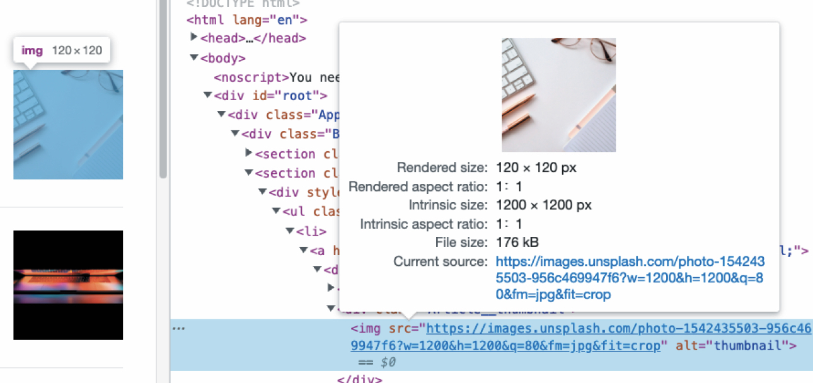

# 블로그 서비스 최적화

블로그 서비스는 **블로그 글 목록 페이지**와 **상세 페이지**로 구성되어 있으며, 사용자 경험과 성능 향상을 위해 다양한 최적화가 필요합니다. 이번 아티클에서는 로딩 성능 및 렌더링 성능 최적화 관점에서 적용 가능한 기술들을 구체적으로 설명합니다.

<br />

## 1. 이미지 사이즈 최적화 (로딩 성능 최적화)

### (1) 왜 필요한가?

- 지나치게 큰 이미지 사용 시 **네트워크 트래픽 증가** → **페이지 로딩 지연**
- 이미지가 너무 작으면 **해상도 저하로 사용자 경험 저하**
- ⇒ **서비스 목적과 화면 해상도에 맞는 최적 사이즈** 설정이 중요

### (2) 해결 방안

- **이미지 CDN 사용**: 사용자 위치에 가까운 서버에서 이미지 전송
- **적절한 크기로 리사이징**: 예) 1200x1200px → 240x240px

<br />

## 2. 코드 분할 (로딩 성능 최적화)

### 개념

React 기반 SPA에서는 초기 진입 시 모든 코드가 하나의 JS 번들로 묶여 **불필요한 코드까지 로드**됩니다.

### 해결 방안

- **Code Splitting** 기법 도입
- **필요한 시점에 필요한 코드만 동적 로딩**

```js
// 예시: React.lazy() + Suspense 사용
const PostDetail = React.lazy(() => import('./PostDetail'));

<Suspense fallback={<div>Loading...</div>}>
  <PostDetail />
</Suspense>
````

<br />

## 3. 텍스트 압축 (로딩 성능 최적화)

### 개념

HTML, CSS, JS 등의 텍스트 기반 리소스는 서버에서 미리 압축하여 전송하면 **용량 감소** → **빠른 다운로드 및 렌더링 가능**

### 주요 압축 방식

* Gzip
* Brotli

> 서버 응답 헤더 예시: `Content-Encoding: gzip`

<br />

## 4. 병목 코드 최적화 (렌더링 성능 최적화)

### 개념

브라우저 렌더링을 **지연**시키는 무거운 연산이나 리렌더링이 자주 발생하는 **병목 코드**는 서비스 속도 저하의 원인입니다.

### 병목 코드 식별 & 최적화 방법

* **Chrome Performance 탭 분석**
* React에서는 `React DevTools`의 **렌더링 확인**
* 불필요한 re-render 방지 (예: `useMemo`, `React.memo`)

<br />

## 분석 도구 목록

* **Chrome DevTools**

  * Network 탭
  * Performance 탭
  * Lighthouse 탭
* **webpack-bundle-analyzer**

<br />
<br />
<br />

# Lighthouse 툴을 이용한 성능 지표 분석


## 주요 지표 설명

### 1. First Contentful Paint (FCP)

> 사용자가 화면에서 **첫 번째 DOM 요소를 볼 수 있게 되는 시점**

* 좋은 점수 기준: **1.8초 이하**

### 2. Speed Index (SI)

> 페이지에서 **시각적 콘텐츠가 얼마나 빠르게 로드되는가**

### 3. Largest Contentful Paint (LCP)

> 화면에 보이는 **가장 큰 이미지 또는 텍스트 요소가 렌더링 완료된 시점**

* 좋은 점수 기준: **2.5초 이하**

### 4. Time to Interactive (TTI)

> 사용자가 페이지와 **상호작용할 수 있을 때까지 걸리는 시간**

### 5. Total Blocking Time (TBT)

> 페이지가 이벤트 처리 불가능한 시간의 총합

* 좋은 점수 기준: **200ms 이하**

### 6. Cumulative Layout Shift (CLS)

> 로딩 중 예기치 않게 **레이아웃이 이동**한 비율의 총합

* 좋은 점수 기준: **0.1 이하**

<br />
<br />

# 이미지 사이즈 최적화

## 1. 이미지 CDN이란?

CDN(Content Delivery Network)은 콘텐츠를 사용자와 가까운 서버에서 제공하여 로딩 속도를 높이는 기술입니다.

* **예시 시나리오**: 미국 서버 → 한국 서버에 **미리 복사** → 한국 사용자 요청 시 **근처에서 다운로드**
* **이미지 CDN**은 이미지 전송에 특화된 CDN이며, 추가적으로 **리사이징, 포맷 변경, 압축 등**의 가공이 가능


<br />

## 2. 적절한 이미지 크기로 최적화

### 원래 이미지



### 최적화 적용


> → `width=240`, `height=240`으로 사이즈 축소
> → `fit=crop`으로 비율 유지
> → `q=80`으로 품질 조절

### 적용 코드 예시

**(1) 적용 전**

```jsx

```

<br />

**(2) 적용 후**

```jsx

```
<br/>

## 3. 최적화 효과 확인


* **요소 검사 도구**에서 `Intrinsic size`가 240x240으로 변경된 것을 확인
* **Lighthouse 성능 점수**

  * 최적화 전: **47점**
  * 최적화 후: **56점**
  * `"Properly size images"` 항목 **사라짐**


<br/>

## 정리

| 최적화 기법      | 목적           | 기대 효과            |
| ----------- | ------------ | ---------------- |
| 이미지 사이즈 최적화 | 네트워크 로딩 단축   | 트래픽 감소, 로딩 속도 개선 |
| 코드 분할       | 초기 번들 사이즈 감소 | 렌더링 속도 개선        |
| 텍스트 압축      | 전송 용량 감소     | 페이지 로딩 속도 개선     |
| 병목 코드 제거    | 렌더링 효율 향상    | 인터랙티브성 향상        |

<br/>

> **블로그 서비스의 성능 최적화는 단순히 빠르게 보이게 하는 것이 아닌, 사용자의 체감 성능과 전체 경험을 향상시키는 핵심 전략입니다.**


