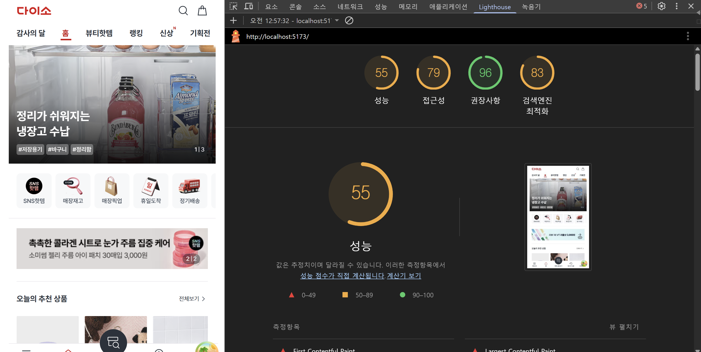
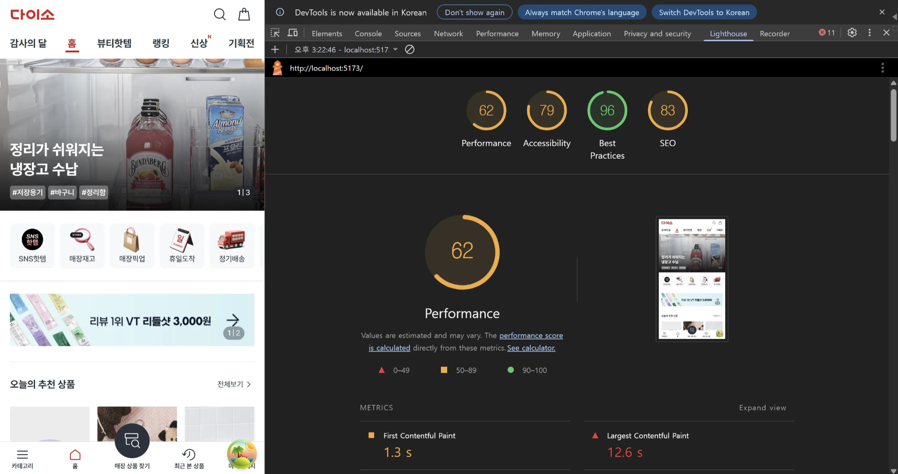
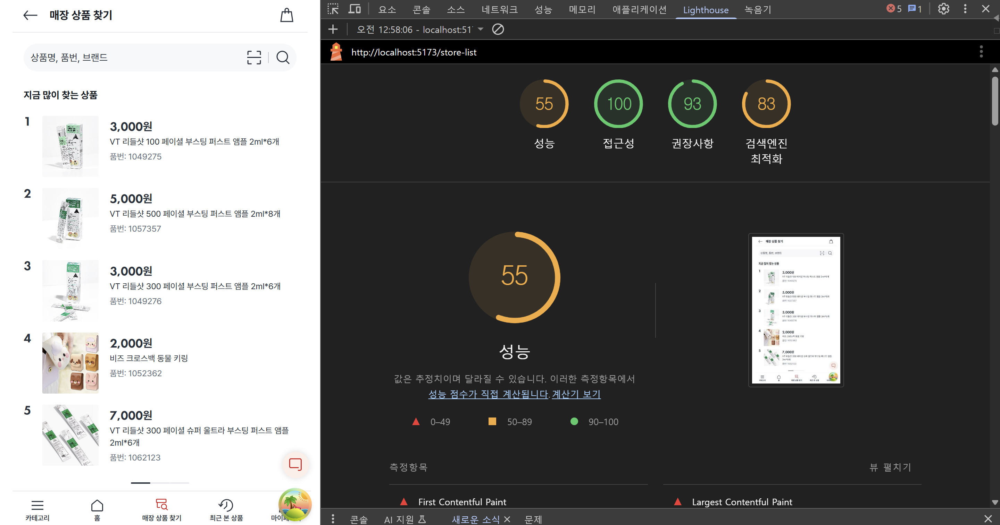
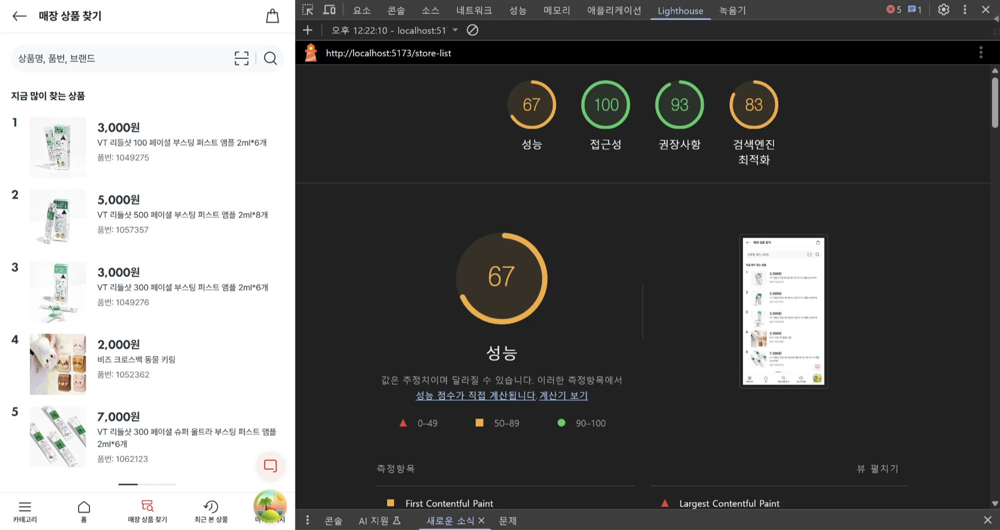
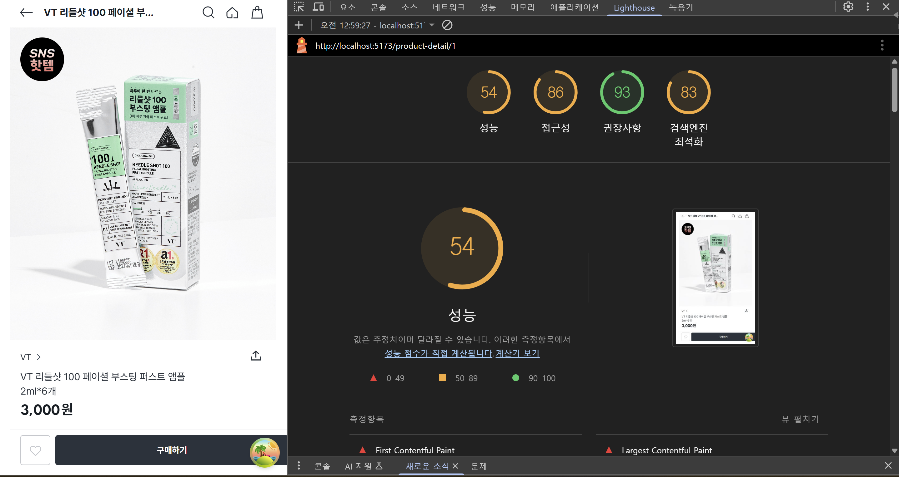
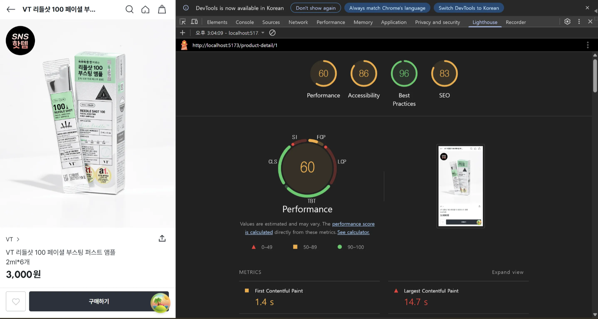

## 프로젝트별 성능 측정 결과 (Lighthouse 기준, 로컬 측정)


- 홈페이지: 55점 → 62점
- 상품 검색 페이지: 55점 → 67점
- 상품 상세 페이지: 54점 → 60점

> 위 점수는 로컬 측정 기준이며, CDN, 브라우저 캐시, 압축 설정이 적용된 실제 배포 환경에서는 더 높은 점수를 기대할 수 있습니다.


<br />

### 홈페이지

---

<p align="center">
  
  
</p>

### 상품 검색 페이지

---

<p align="center">
    
    
</p>

### 상품 상세 페이지

---

<p align="center">
    
    
</p>

<br />

## 최적화 기법 분류


### 성능 최적화 스터디에서 공부한 성능 최적화 기법 적용

### (1) 페이지 단위 Lazy 로딩 + Suspense 적용

- 페이지 라우팅 수준에서 `lazy + Suspense` 적용
- 초기 진입 번들 사이즈 감소 → TTI, LCP 향상 기대

```tsx
import { lazy, Suspense } from 'react';
import type { ReactElement } from 'react';
import type { RouteType } from '@app-types/routeType';
import routePath from '@routes/routePath';

const HomePage = lazy(() => import('@pages/HomePage/HomePage'));
const ProductDetailPage = lazy(
  () => import('@pages/ProductDetailPage/ProductDetailPage'),
);
const StoreSearchPage = lazy(
  () => import('@pages/StoreSearchPage/StoreSearchPage'),
);

const withSuspense = (component: ReactElement): ReactElement => (
  <Suspense fallback={<div>페이지 로딩 중...</div>}>{component}</Suspense>
);

const pageRoutes: RouteType[] = [
  {
    path: routePath.HOME,
    element: withSuspense(<HomePage />),
  },
  {
    path: routePath.STORE_LIST,
    element: withSuspense(<StoreSearchPage />),
  },
  {
    path: routePath.PRODUCT_DETAIL,
    element: withSuspense(<ProductDetailPage />),
  },
  {
    path: '/product-detail/1',
    element: withSuspense(<ProductDetailPage />),
  },
];

export default pageRoutes;
```

<br />

### (2) 이미지 Lazy Loading + decoding="async"

- 적용 위치: ImageCarousel, ProductCardVertical, ReviewCarousel 등 거의 모든 이미지 컴포넌트

```tsx

```

<br />

### (3) 메모이제이션 최적화

- `React.memo`, `useMemo` 활용
- 예시: ProductCardVertical, MethodItem, HomeSectionCard 내부 productList 렌더링 등

```tsx
const renderedProducts = useMemo(() => (
  productList.map((product) => <ProductCardVertical key={product.id} {...product} />)
), [productList]);
```

```tsx
const mainImages = useMemo(() => {
  return productData?.productImages?.main?.map(...) || [];
}, [productData?.productImages?.main]);
// 이미지 배열 정제에 useMemo 적용
```

```tsx
// React.memo로 컴포넌트 결과를 메모이제이션하여 props 변경 없을 시 리렌더링 방지
export default memo(LocationCard);
```

<br />

### (4) 이벤트 핸들러에 useCallback 적용

- `useCallback`을 통해 함수가 불필요하게 재생성되는 것을 방지
- props로 넘겨줄 때 하위 컴포넌트의 불필요한 리렌더링 방지 효과

```tsx
const handleBeforeChange = useCallback((_: number, next: number) => {
  setCurrentIndex(next);
}, []);
```

<br />

### 추가 적용한 최적화 기법

### (1) 폰트 렌더링 최적화 (FOUT/FOIT 방지)

- 참고 문서: https://sol-mi.tistory.com/87
- 적용 코드 (index.html 내부)

```html
<link rel="preconnect" href="https://cdn.jsdelivr.net" crossorigin="anonymous">
<link rel="preload" as="style" onload="this.onload=null;this.rel='stylesheet'" href="https://cdn.jsdelivr.net/gh/orioncactus/pretendard@v1.3.8/dist/web/variable/pretendardvariable-dynamic-subset.css">
<link rel="stylesheet" href="https://cdn.jsdelivr.net/gh/orioncactus/pretendard@v1.3.8/dist/web/variable/pretendardvariable-dynamic-subset.css" />
```

- CSS 설정

```css
@font-face {
  font-family: 'Pretendard';
  **font-display: swap;**
}
```

- 폰트 로딩 대기 중 기본 폰트 표시 → 텍스트 깜빡임 제거, FCP 개선

<br />

### (2) 조건부 렌더 차단 (상품 검색 페이지)

- 초기 렌더 시 불완전한 데이터를 기반으로 컴포넌트가 그려지는 것 방지

```tsx
if (location.state?.productId && allProducts.length === 0) return null;
```

- 효과: 잘못된 데이터 기반 불필요한 렌더 차단 → CLS 개선

### (3) 스크롤 이벤트에 requestAnimationFrame 적용 (`ticking`)

- 웹 애니메이션 최적화
- 스크롤 이벤트 과잉 호출 방지
- `requestAnimationFrame` + `ticking` 패턴으로 최적화 → 60fps 유지에 도움
- [참고 자료](https://inpa.tistory.com/entry/%F0%9F%8C%90-requestAnimationFrame-%EA%B0%80%EC%9D%B4%EB%93%9C)

```tsx
useEffect(() => {
  const handleScroll = () => {
    if (!ticking.current) {
      window.requestAnimationFrame(() => {
        const currentY = window.scrollY;
        setShowHeader(currentY < lastScrollY.current);
        lastScrollY.current = currentY;
        ticking.current = false;
      });
      ticking.current = true;
    }
  };

  window.addEventListener('scroll', handleScroll);
  return () => window.removeEventListener('scroll', handleScroll);
}, []);
```

<br />

## 최적화 효과 정리


| 항목 | 적용 기법 | 기대 효과 |
| --- | --- | --- |
| JS 초기 번들 크기 감소 | React.lazy, Suspense | TTI 개선 |
| 이미지 지연 로딩 | loading="lazy" + decoding | LCP, FCP 개선 |
| 렌더링 최적화 | memo, useMemo | TBT 개선 |
| 폰트 깜빡임 제거 | font-display: swap + preload | FCP, CLS 개선 |
| scroll 처리 최적화 | requestAnimationFrame | CLS, TBT 개선 |

<br />

## 더 개선할 수 있는 부분…


- WebP `<picture>` 포맷 도입 (현재는 미적용)
- SSR 혹은 React Server Components를 통한 초기 로딩 개선(넥제가 아니라서 어렵지만..)
- 이미지 CDN 도입 (e.g. imgix, Cloudflare)
- Vite 빌드 시 gzip 외 Brotli 병렬 압축 적용